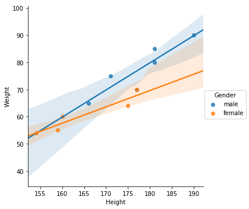
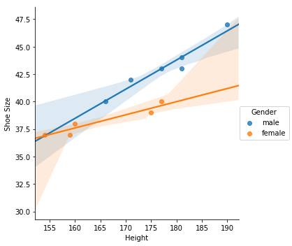
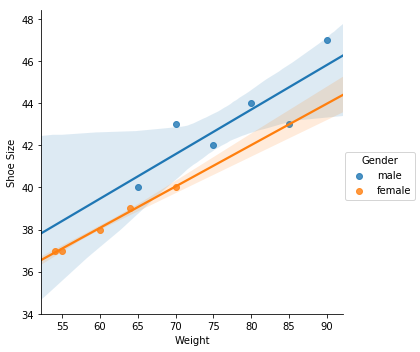

My solution to the challenge of Siraj's "Learn Python for Data Science - Introduction"

You can find the video here: [YouTube](https://www.youtube.com/watch?v=T5pRlIbr6gg&t=1s)


```python
#importing libraries
from sklearn import tree
from sklearn.neighbors import KNeighborsClassifier
from sklearn.svm import SVC
from sklearn.gaussian_process import GaussianProcessClassifier
from sklearn.metrics import accuracy_score

import matplotlib.pyplot as plt
%matplotlib inline
import numpy as np
import seaborn as sns
import pandas as pd

#Declaring classifer object
clf_tree = tree.DecisionTreeClassifier()
clf_svm = SVC()
clf_KNC = KNeighborsClassifier()
clf_GPC = GaussianProcessClassifier()

#Here we are taking X as fetures and Y as labels
X = [[181, 80, 44], [177, 70, 43], [160, 60, 38], [154, 54, 37], [166, 65, 40],
     [190, 90, 47], [175, 64, 39],
     [177, 70, 40], [159, 55, 37], [171, 75, 42], [181, 85, 43]]

Y = ["male", "male", "female", "female", "male", "male", "female", "female", "female", "male", "male"]

#Training the classifier using the data
clf_tree = clf_tree.fit(X, Y)
clf_svm = clf_svm.fit(X, Y)
clf_KNC = clf_KNC.fit(X, Y)
clf_GPC = clf_GPC.fit(X, Y)

#Predict the data using classifier
prediction_tree = clf_tree.predict(X)
prediction_svm = clf_svm.predict(X)
prediction_KNC = clf_KNC.predict(X)
prediction_GPC = clf_GPC.predict(X)

#Check how accurate the data is
acu_tree = accuracy_score(Y, prediction_tree) * 100
acu_svm = accuracy_score(Y, prediction_svm) * 100
acu_KNC = accuracy_score(Y, prediction_KNC) * 100
acu_GPC = accuracy_score(Y, prediction_GPC) * 100

#Display the accuracy
print("Accuracy of DecisionTreeClassifier: {}%".format(acu_tree))
print("Accuracy of Decision Support Vector Classification: {}%".format(acu_svm))
print("Accuracy of Decision KNeighborsClassifier: {}%".format(acu_KNC))
print("Accuracy of Decision GaussianProcessClassifier: {}%".format(acu_GPC))
```

    Accuracy of DecisionTreeClassifier: 100.0%
    Accuracy of Decision Support Vector Classification: 100.0%
    Accuracy of Decision KNeighborsClassifier: 72.72727272727273%
    Accuracy of Decision GaussianProcessClassifier: 100.0%


After this I went ahead and played a little more with the data.

I created a ditionary containing the **Height**, **Weight**, **Shoe Size** and **Gender** after converting them to numpy array.


```python
#Creating Dictionary
dic = {'Height': np.array(X)[0:11, 0], 'Weight': np.array(X)[0:11, 1], 'Shoe Size': np.array(X)[0:11, 2], 'Gender': np.array(Y)}
```


```python
#Displaying Dictionary content
dic
```


    {'Gender': array(['male', 'male', 'female', 'female', 'male', 'male', 'female',
            'female', 'female', 'male', 'male'],
           dtype='<U6'),
     'Height': array([181, 177, 160, 154, 166, 190, 175, 177, 159, 171, 181]),
     'Shoe Size': array([44, 43, 38, 37, 40, 47, 39, 40, 37, 42, 43]),
     'Weight': array([80, 70, 60, 54, 65, 90, 64, 70, 55, 75, 85])}


Then I created a pandas dataframe using the dictionary.


```python
#Dictionary to pandas Dataframe
df = pd.DataFrame(dic)
```


```python
#Displaying Dataframe
df
```


<div>
<style>
    .dataframe thead tr:only-child th {
        text-align: right;
    }

    .dataframe thead th {
        text-align: left;
    }

    .dataframe tbody tr th {
        vertical-align: top;
    }
</style>
<table border="1" class="dataframe">
  <thead>
    <tr style="text-align: right;">
      <th></th>
      <th>Gender</th>
      <th>Height</th>
      <th>Shoe Size</th>
      <th>Weight</th>
    </tr>
  </thead>
  <tbody>
    <tr>
      <th>0</th>
      <td>male</td>
      <td>181</td>
      <td>44</td>
      <td>80</td>
    </tr>
    <tr>
      <th>1</th>
      <td>male</td>
      <td>177</td>
      <td>43</td>
      <td>70</td>
    </tr>
    <tr>
      <th>2</th>
      <td>female</td>
      <td>160</td>
      <td>38</td>
      <td>60</td>
    </tr>
    <tr>
      <th>3</th>
      <td>female</td>
      <td>154</td>
      <td>37</td>
      <td>54</td>
    </tr>
    <tr>
      <th>4</th>
      <td>male</td>
      <td>166</td>
      <td>40</td>
      <td>65</td>
    </tr>
    <tr>
      <th>5</th>
      <td>male</td>
      <td>190</td>
      <td>47</td>
      <td>90</td>
    </tr>
    <tr>
      <th>6</th>
      <td>female</td>
      <td>175</td>
      <td>39</td>
      <td>64</td>
    </tr>
    <tr>
      <th>7</th>
      <td>female</td>
      <td>177</td>
      <td>40</td>
      <td>70</td>
    </tr>
    <tr>
      <th>8</th>
      <td>female</td>
      <td>159</td>
      <td>37</td>
      <td>55</td>
    </tr>
    <tr>
      <th>9</th>
      <td>male</td>
      <td>171</td>
      <td>42</td>
      <td>75</td>
    </tr>
    <tr>
      <th>10</th>
      <td>male</td>
      <td>181</td>
      <td>43</td>
      <td>85</td>
    </tr>
  </tbody>
</table>
</div>


Now I started ploting some **linear model plots**. Here we have two regression one with **Male** and other with **Female**. The plot itself show a lot of relation stuff inspite of data being so small.

#### Plot between *Height* and *Weight*


```python
sns.lmplot(x='Height', y='Weight', hue='Gender', data=df)
```


    <seaborn.axisgrid.FacetGrid at 0x7f40c25ff780>





#### Plot between *Height* and *Shoe Size*


```python
sns.lmplot(x='Height', y='Shoe Size', hue='Gender', data=df)
```


    <seaborn.axisgrid.FacetGrid at 0x7f40c0d79908>





#### Plot between *Weight* and *Shoe Size*


```python
sns.lmplot(x='Weight', y='Shoe Size', hue='Gender', data=df)
```


    <seaborn.axisgrid.FacetGrid at 0x7f40c0cdae10>





Reference: 

* [sklearn classifier comparison](http://scikit-learn.org/stable/auto_examples/classification/plot_classifier_comparison.html)

* ['Siraj Raval's Introduction - Learn Python for Data Science #1'](https://www.youtube.com/watch?v=T5pRlIbr6gg)

* [Google Developers's 'Let’s Write a Pipeline - Machine Learning Recipes #4'](https://youtu.be/84gqSbLcBFE?list=PLT6elRN3Aer7ncFlaCz8Zz-4B5cnsrOMt)
